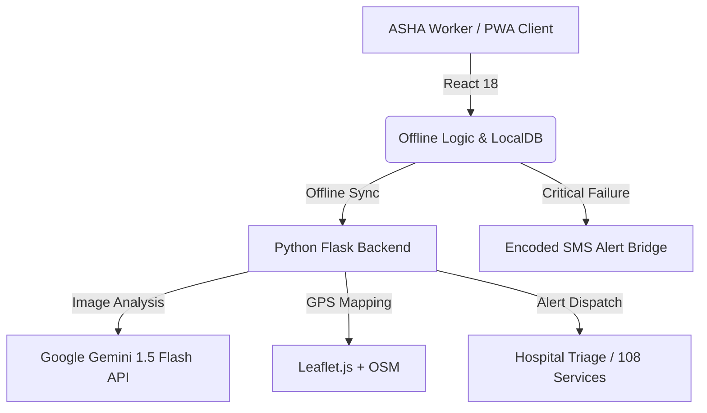

# 🌱 JanRakshak AI: "Predict Before It's Critical"
### 🏆 VISION X 2026 National Level Hackathon Submission

[](https://reactjs.org/)
[](https://flask.palletsprojects.com/)
[](https://deepmind.google/technologies/gemini/)
[](https://web.dev/progressive-web-apps/)
[](https://opensource.org/licenses/MIT)

---

## 📽️ Submission Details
- **Team Name:** Code Warriors
- **Problem Code:** PH001 (Rural Healthcare Intelligence)
- **Demo Video Link:** [Watch Demo on YouTube / Drive](https://1drv.ms/v/c/2ebbeb31c047906b/IQBxKWIECHSkQZf7XmTzOS3yARp8o5k5U2dGGzD7V4QbTes?e=TgE1uG)
- **Live Presentation:** [D:\hackthon\JanRakshak_AI_Elite_Presentation.pptx](https://1drv.ms/p/c/2ebbeb31c047906b/IQAkGV1JExaBR58iVxIO9A0SAToJf98oR1ZPV7R5depo6F0?e=QCIhXb)

---

## 📖 Introduction
**JanRakshak AI** is a hyper-resilient, offline-first medical intelligence platform designed specifically for **India's 1.2 Million ASHA workers**. It brings clinical-grade AI diagnostics and risk scoring to a ₹6,000 smartphone, ensuring that the **600 Million rural citizens** living in "Dark Zones" (no internet) are never more than a few clicks away from a life-saving diagnosis.

---

## 🔴 The Problem Statement
Rural India faces a three-fold healthcare crisis:
1.  **Late Detection:** 1.4 Million preventable deaths annually due to delayed diagnosis.
2.  **Analog Bottleneck:** 95% of ASHA workers still use paper registers with no way to calculate health risks.
3.  **Connectivity Gap:** Existing healthcare apps rely on "The Cloud," making them useless in villages with zero signal.

---

## 💡 Proposed Solution
We have built a **"Pocket PHC"** (Primary Health Centre) that decentralizes intelligence:
- **AI-Powered Prediction:** Instead of just recording data, we use **Gemini 1.5 Flash** and custom clinical logic to **Predict** risks for Heart, Diabetes, and Pregnancy.
- **Hyper-Resiliency:** 100% of the risk-scoring works **Offline**. If the internet fails, the app uses an **SMS Fallback Bridge** to alert doctors.
- **Literacy-Ready:** Multilingual AI voice feedback in **Hindi, Telugu, and English** bridges the divide for non-literate patients.

---

## 🛠️ Technical Architecture



### **The Engine Room:**
- **Frontend:** React 18, Vite, Glassmorphism CSS, Service Workers (PWA).
- **Backend:** Python Flask API with custom clinical heuristics.
- **Intelligence:** Google Gemini 1.5 Flash (X-Ray & Wound Vision).
- **Database:** Encrypted LocalStorage (Client) & SQLite (Server).
- **GIS:** OpenStreetMap + Nominatim API for patient-to-hospital routing.

---

## ✨ Core Features
| Feature | Implementation | Impact |
| :--- | :--- | :--- |
| **AI Risk Scoring** | Custom clinical thresholds (Vitals) | 48% faster triage for chronic cases. |
| **X-Ray & Wound Scan** | Gemini Vision Pro Integration | Instant fracture & infection screening. |
| **Maternal Suite** | PM Janani Suraksha Yojana logic | High-risk pregnancy identification. |
| **1-Tap SOS** | Native `tel:` protocol bypass | Immediate 108 ambulance dispatch. |
| **Traditional Meds** | 80+ Home Remedy Engine | Cultural alignment with rural "Ayurveda" trust. |
| **Multilingual Voice** | Speech Synthesis in Hi/Te/En | Bridges the 30% literacy gap. |

---

## 🚀 Installation & Local Setup

### **1. Clone the Repo**
```bash
git clone https://github.com/kiran122-png/kiran122-png-VISIONX2026_CodeWarriors_PH001.git
cd VISIONX2026_CodeWarriors_PH001
```

### **2. Backend Setup (Flask)**
```bash
cd backend
python -m venv .venv
.venv\Scripts\activate
pip install -r requirements.txt
python app_utf8_clean.py
```
*Backend runs on `http://localhost:5000`*

### **3. Frontend Setup (React)**
```bash
cd frontend
npm install
npm run dev -- --host
```
*Frontend runs on `http://localhost:5176`*

---

## 🌍 Social Impact & SDG Alignment
- **SDG 3:** Good Health & Well-being (Reducing non-communicable disease mortality).
- **SDG 10:** Reduced Inequalities (Equalizing urban and rural healthcare quality).
- **Digital India:** Aligning with **ABHA Card (Ayushman Bharat)** and the **ASHA Digitisation Program**.

---

## 👨‍💻 Team: Code Warriors
- **Member 1:** [Your Name/Role] - Lead Developer
- **Member 2:** [Name/Role] - UI/UX & PWA
- **Member 3:** [Name/Role] - Backend & AI Integration

---

### **🏆 A Healthy India is a Prosperous India.**
*Built with ❤️ for the villages of India. [JanRakshak AI — Predict Before It's Critical]*
